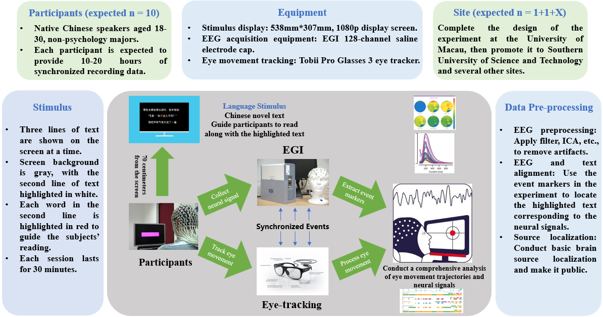
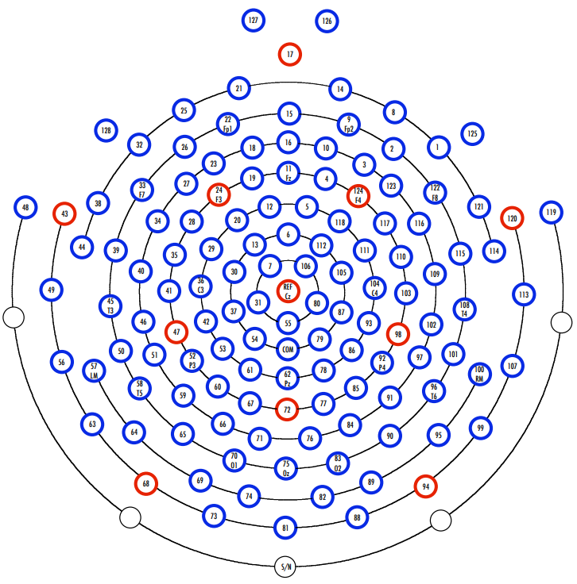
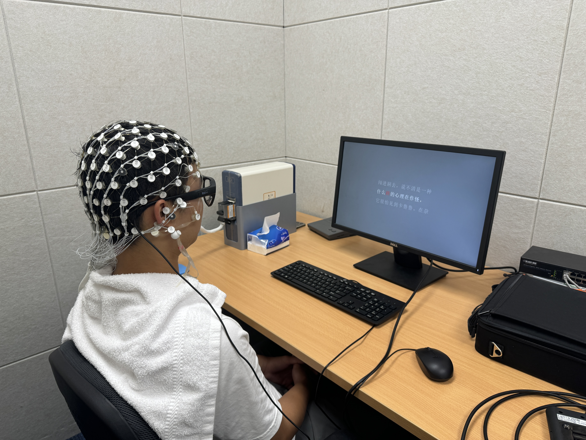

# Chinese Linguistic Corpus EEG Dataset Development and Advanced Semantic Decoding

## Introduction

This project aims to provide a comprehensive paradigm for the establishment of an EEG dataset based on Chinese linguistic corpus. It seeks to facilitate the advancement of technologies related to EEG-based semantic decoding and brain-computer interfaces. The project is currently divided into the following modules: Chinese corpus segmentation, experimental design and stimulus presentation, data preprocessing, and data masking. For detailed information on each module, please refer to the README document in the respective folders or view the relevant code.

For now, We recruited a total of 10 participants whose native language is Chinese. Each participant fully engaged in a Chinese novel reading task with a total duration of 12 hours, collectively accumulating 120 hours of data.

## Pipeline

Our EEG recording and pre-processing pipeline is as follows:

## Device

### EEG Recording: EGI Geodesic EEG 400 series 

During the experiment, The EEG (electroencephalography) data were collected by a `128-channel` EEG system with Geodesic Sensor Net (EGI Inc., Eugene, OR, USA, [Geodesic EEG System 400 series (egi.com)](https://www.egi.com/clinical-division/clinical-division-clinical-products/ges-400-series)). The montage system of this device is `GSN-HydroCel-128`.We recorded the data at a sampling rate of 1000 Hz.

The 128-channel EEG system with Geodesic Sensor Net (GSN) by EGI is a sophisticated brain activity recording tool designed for high-resolution neuroscientific research. This system features an array of evenly spaced sensors providing complete scalp coverage, ensuring detailed spatial data collection without the need for interpolation. Coupled with the advanced Net Amps 400 amplifiers and intuitive Net Station 5 software, it delivers low noise, high sensitivity EEG data acquisition, and powerful data analysis capabilities, making it an ideal choice for dynamic and expanding research environments.

### Eyetracking: Tobii Pro Glasses 3

We utilized Tobii Pro Glasses 3 ([Tobii Pro Glasses 3 | Latest in wearable eye tracking - Tobii](https://www.tobii.com/products/eye-trackers/wearables/tobii-pro-glasses-3)) to record the participants' eye movement trajectories to inspect whether they followed the instructions of the experiment, that is, their gaze should move along with the red highlighted text.

The Tobii Pro Glasses 3 are advanced wearable eye trackers. They are capable of capturing natural viewing behavior in real-world environments, providing powerful insights from a first-person perspective. The device features 16 illuminators and four eye cameras integrated into scratch-resistant lenses, a wide-angle scene camera, and a built-in microphone, allowing for a comprehensive capture of participant behavior and environmental context. Its eye tracking is reliable across different populations, unaffected by eye color or shape. The Tobii Pro Glasses 3 operates with a high sampling rate of 50 Hz or 100 Hz. It supports a one-point calibration procedure. 

## Experiment

In the preparation phase of the experiment, we initially fitted participants with EEG caps and eye trackers, maintaining a distance of 67 cm from the screen. We emphasized to the participants that they should keep their heads still during the experiment, and their gaze should follow the red highlighted text as shown in the figure. 

After ensuring the participants fully understood the instructions, we commenced the experimental procedure. Initially, there was an eye tracker calibration phase, followed by a practice reading phase, and finally the formal reading phase. Each formal reading phase lasted for approximately 30 minutes. The experimental setup is as below:

## Credit 

- [Mou Xinyu](https://github.com/12485953) - Coder for all parts of the project, Data processing, README writer for all parts.

- [He Cuilin](https://github.com/CuilinHe) - Experiment conductor, Data processing, README writing.

- [Tan Liwei](https://github.com/tanliwei09) - Experiment conductor, Data processing, README writing.

- [Zhang Jianyu](https://github.com/ionaaaa) - Coder for Chinese corpus segmentation and EEG random masking.
  
- [Tian Yan](https://github.com/Bryantianyan) - Experiment conductor

- [Chen Yizhe]() - Experimental instrument debugging

  Feel free to contact us if you have any questions about the project !!!
  
## Collaborators
- [Wu Haiyan](https://github.com/haiyan0305)  -  澳门大学

- [Liu Quanying] - 南方科技大学
  
- [Wang Xindi](https://github.com/sandywang) 

- [Wang Qing] - 上海精神卫生中心
  
- [Chen Zijiao] - National University of Singapore
  
- [Yang Yu-Fang] - Freie Universität Berlin
  
- [Hu Chuanpeng] - 南京师范大学
  
- [Xu Ting] - Child Mind Institute

- [Cao Miao] - 北京大学

- [Liang Huadong](https://github.com/Romantic-Pumpkin) - 科大讯飞股份有限公司
## Funding

本项目受到天桥脑科学研究院MindX数据支持计划的部分资助（共计伍万元）。
其余资助来源:澳门科学技术发展基金项目(FDCT)
