# Docker Tutorial

## Introduction

This content is intended to facilitate researchers who are not familiar with setting up a Python environment. Although each section's `README` document already lists the required packages and their versions, we still provide a Docker image that includes all dependencies for the project, to simplify the environment setup process. Docker can run a virtual container on Linux, Windows, or macOS computers, which contains an application and its dependencies. Therefore, users only need to follow this tutorial to download Docker, pull the image, and run the container, to easily set up the environment for running the code.

The two core concepts of Docker are `images` and `containers`. A Docker `image` is a read-only template used to build containers, which stores and transmits applications. A Docker `container` is a standardized, encapsulated environment for running applications, and can be considered as an independent operating system running on the host machine. In practice, we first pull an image and then use it to build our own container, in which we carry out operations such as running code.

Our Docker image [mouxinyu/eeg_dataset](https://hub.docker.com/r/mouxinyu/eeg_dataset) is based on [ubuntu:22.04](https://hub.docker.com/_/ubuntu) and includes project code pulled from [GitHub repositories](https://github.com/ncclabsustech/Chinese_reading_task_eeg_processing). Additionally, the image is configured with [Pycharm](https://www.jetbrains.com/pycharm/download/?section=linux) that supports a graphical user interface, allowing users to operate through the GUI while running the container, avoiding complex command-line editing. The source code of the dockerfile is in `docker` directory.

**The following tutorial will detail how to use Docker to apply our image on the Windows operating system**. The methods for other operating systems will be slightly different and are not elaborated here.

If you want to know more about Docker, you can browse its [official website](https://www.docker.com/).

## Step-by-step Tutorial

### Docker Installation

For detailed instructions on how to download Docker on a Windows system, it is recommended to refer to the [comprehensive guide](https://docs.docker.com/desktop/install/windows-install/) provided in the official documentation. Here we give a brief instruction.

#### WSL Installation

Before downloading Docker, ensure that the Windows Subsystem for Linux (WSL) is installed on your system. We recommend that you follow the [official guidelines](https://learn.microsoft.com/en-us/windows/wsl/install) to ensure the proper functioning of WSL. Below, we provide a simplified installation process and some important commands for your reference.

You can install wsl by opening the command line interface and executing the following commands:

```
wsl --install
```

Please ensure that the default version of WSL is set to WSL2. You can specify the default version by executing the following command:

```
wsl --set-default-version 2 
```

You can also view the list of Linux distributions installed on your Windows computer by using the following command:

```
wsl -l -v
```

Other basic commands for WSL can be found in its [official documentation](https://learn.microsoft.com/en-us/windows/wsl/basic-commands).

#### Docker Installation

Once you have verified that WSL is properly installed, you can proceed with the installation of Docker. Please install the version corresponding to your operating system. The installation path for Windows systems is provided [here](https://docs.docker.com/desktop/install/windows-install/).

After completing the download steps as instructed in the document, double-click to open Docker Desktop, and you will see the interface as shown in the following image.

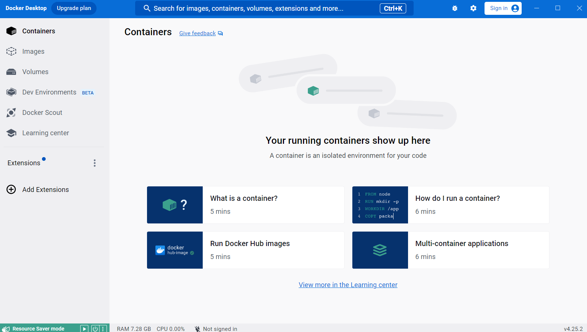

### VcXsrv Installation

Docker does not provide GUI by default. To address this issue, we need to install VcXsrv on the Windows host machine (this solution is also applicable to Mac). Download it from the official website provided [here](https://sourceforge.net/projects/vcxsrv/).

After downloading, double-click to install it. Once the installation is complete, open VcXsrv (named Xlaunch after installation) from the start menu. If it's not found in the start menu, you can use the search function to locate it. Upon opening, a settings page will appear.

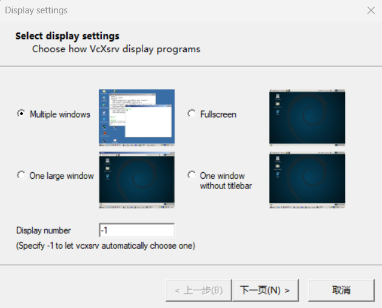

Simply keep the default settings and click 'Next' until you reach the end, and then click 'Finish' to start VcXsrv. After it starts, you can see the following icon in the dock, indicating a successful launch.


### Image Pulling

Now, we will deploy our environment by pulling the image from [Docker Hub](https://hub.docker.com/) and running it to create a container.

First, please ensure that you have successfully launched Docker Desktop and have opened VcXsrv as previously instructed. Next, open the command line interface and enter the following command to pull the required image from Docker Hub:

```
docker pull mouxinyu/eeg_dataset
```

After you enter this command and press the enter key to execute it. If you see the following response in the command line interface, the image is successfully pulled:

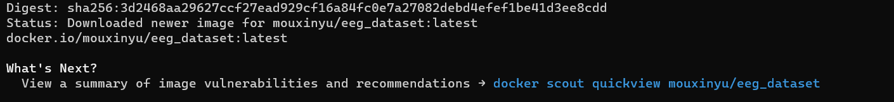

### Run Container

Next, we can create a container using the image we have just pulled. You can create a container by executing the following command:

```
docker run --name eeg_dataset_container -it -v <path/to/your/windows/mount/point>:<path/to/your/container/mount/point> mouxinyu/eeg_dataset
```

The explanation of the relevant parameters is as follows:

- --name: This parameter specifies the name of the container being created, which we can later use to refer to the specific container.
- -it: This command runs the container in interactive mode and allocates a pseudo terminal for the container.
- -v: This command mounts a file system address from the host machine to a corresponding address inside the container, allowing file exchange between the container and the host machine. `:` is used to separate the paths on the two systems, with the left side being the path on the host machine and the right side the path within the container, which is recommended to be set as `/home/mynewuser/mount`.

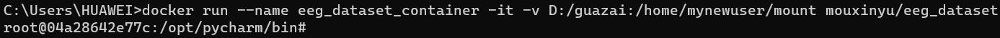

The container by default has two users, one is the `root` user, and the other is a user named `mynewuser`. When entering the container, by default, you are in the `/opt/pycharm/bin` directory under the `root` user.

We recommend that you switch to user `mynewuser` for most operations, and you can switch users using the following command:

```
su mynewuser
```

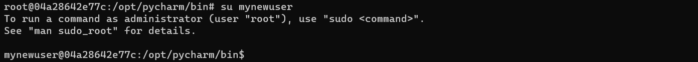

#### GUI 

In `/opt/pycharm/bin`, enter the following command to open the GUI interface of Pycharm:

```
sh pycharm.sh
```

If you successfully run the GUI, the following interface will appear:

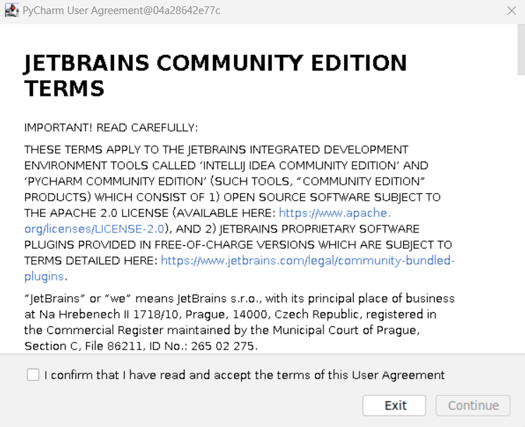

Confirm the user agreement and enter the pycharm interface:

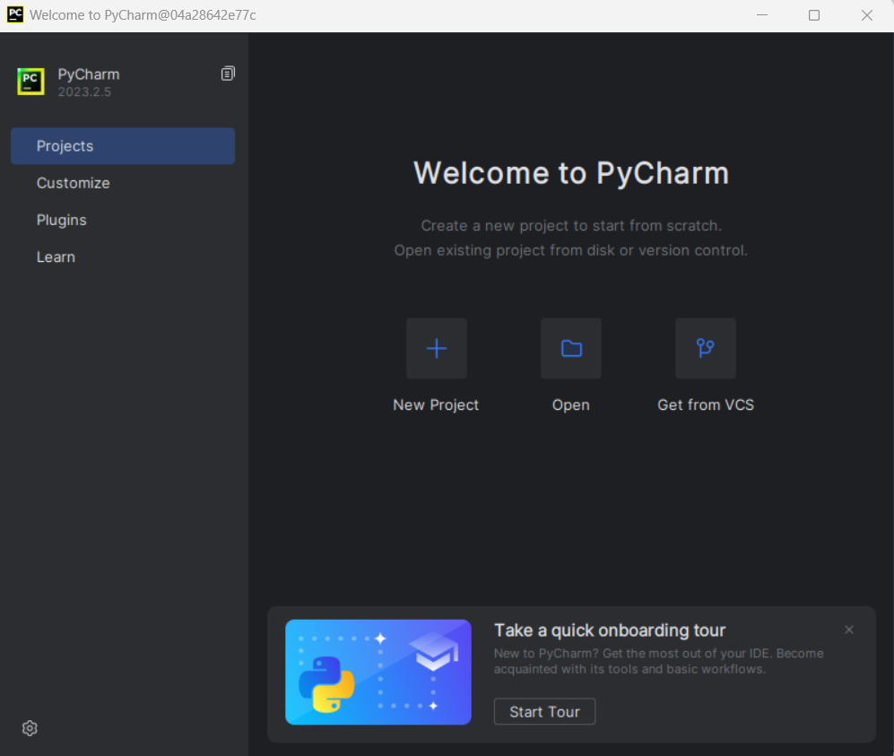

Select the 'Open' option in the middle part, and choose `home/mynewuser/Chinese_reading_task_eeg_processing` to open the project.

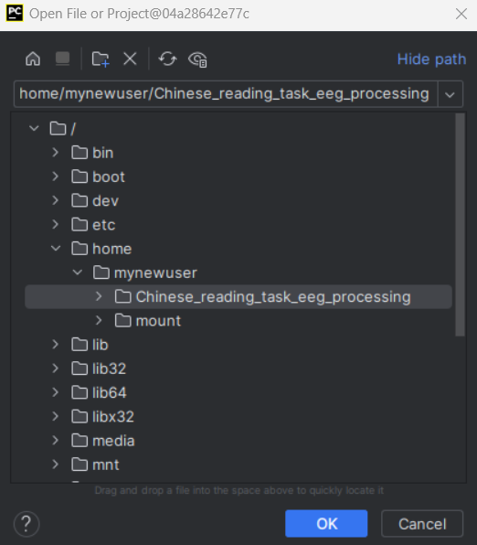

Here, select 'Trust Project' to open the project.

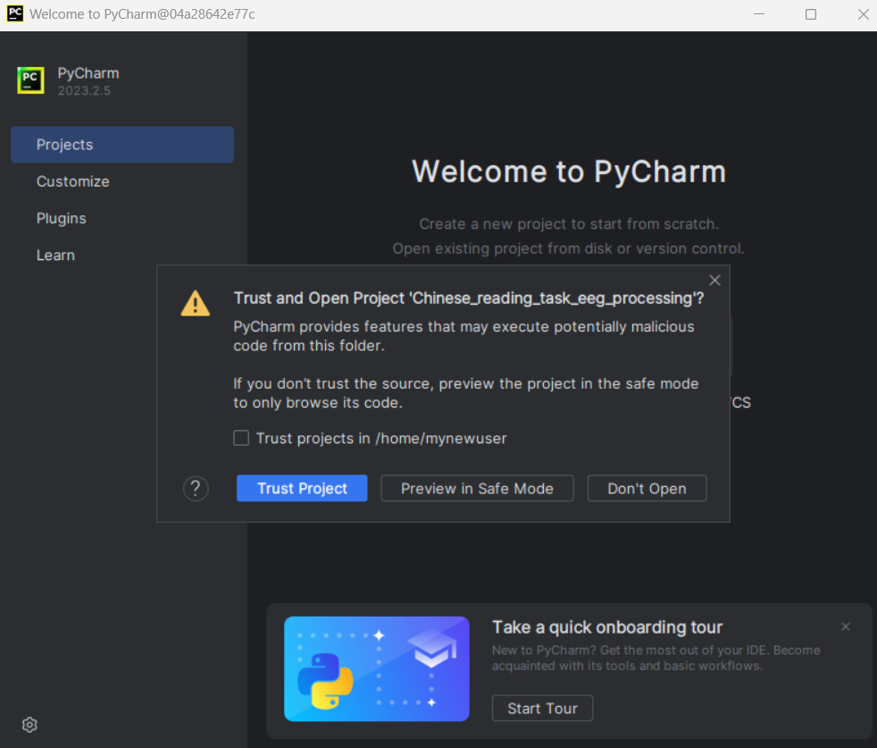

Typically, Pycharm will automatically detect the virtual environment `eeg_dataset_env` in the project folder and configure it automatically (this may take some time if it's your first time setting up this environment). However, if Pycharm does not automatically recognize the environment, you can manually configure it using the steps below:

Click on the bottom right area of the Pycharm page, and select `Add New Interpreter --> Add Local Interpreter` .

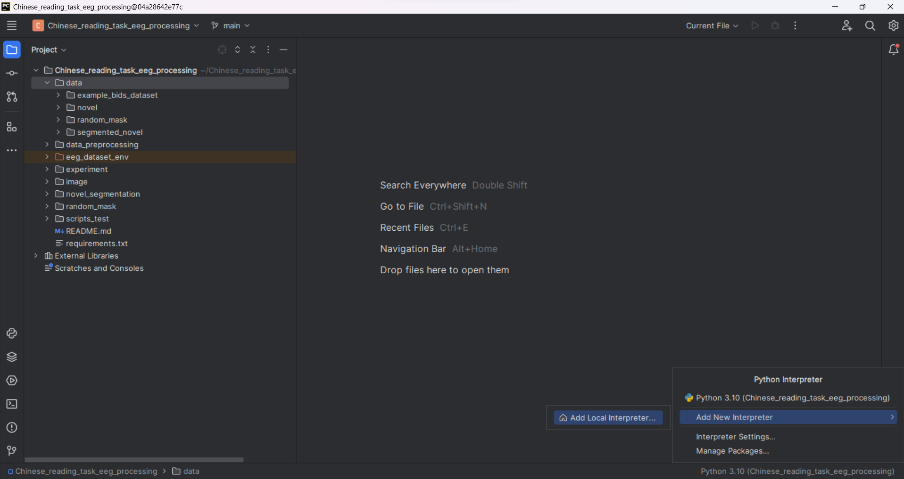

In the PyCharm settings interface, select `Virtualenv Environment` from the sidebar on the left. Then in the `Environment` section, choose the `Existing` option to specify a pre-existing environment.

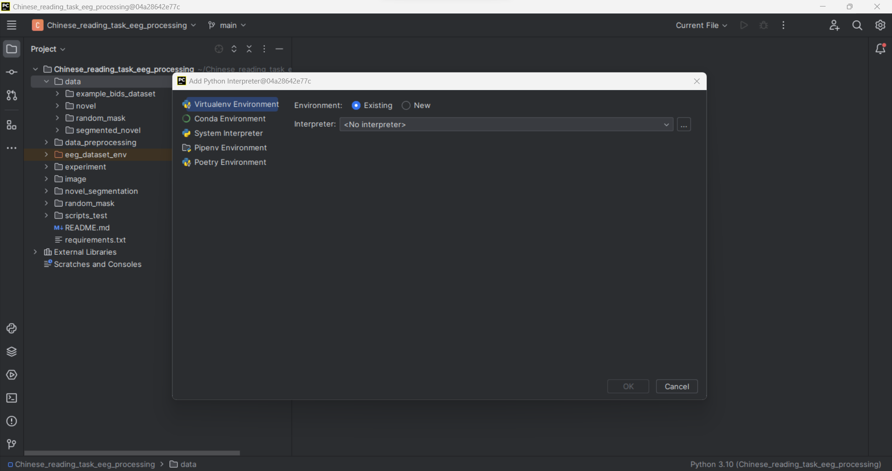

Then select `/home/mynewuser/Chinese_reading_task_eeg_processing/eeg_dataset_env/bin/python3.10` as the interpreter. Press `OK` to configure the environment.

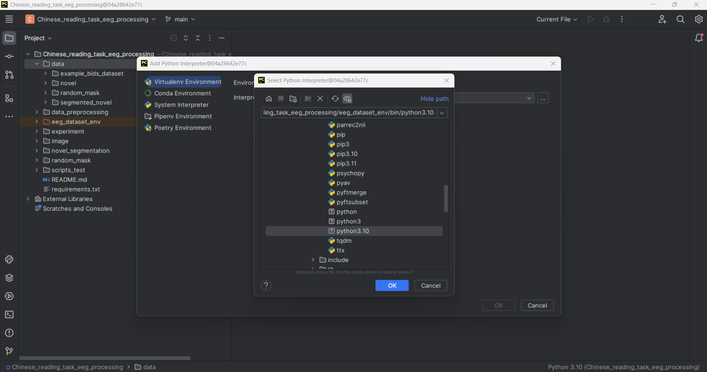

Now, you can edit and run code within PyCharm.

Caveat: If you intend to use the `matplotlib` package for plotting, please insert the following lines of code at the very beginning of your code file:

```
import matplotlib
matplotlib.use('TkAgg')
import matplotlib.pyplot as plt
import tkinter as tk
```

However, if you are using the integrated plotting functions within the `mne` package, you can disregard this step.

#### Command Line

If you are familiar with Linux command line operations, you can also perform corresponding actions using the command line. We have already configured tools like the vim editor for you. It's important to note that command line operations can only be done when the GUI is closed.

### Mount

To exchange files between your host machine and your container, you'll need to utilize Docker's mounting feature. Please write the files you wish to save to the mount point in the container (if you followed our earlier recommendation, this mount point should be at `/home/mynewuser/mount`). Then, these files will appear at the designated location on your host machine. Similarly, you can place files from the host machine at its mount point, and then access these files at the mount point within the container. We highly recommend you to load and write data using the mount feature to avoid issues with memory or other possible problems.

### Exit

We can switch back from the `mynewuser` user to the `root` user using the `exit` command, and similarly, we can exit the container by using the `exit` command while in the `root` user.

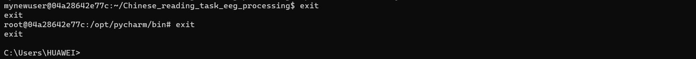

### Other Docker Command

If you have already closed the container and wish to re-enter the container's command line interface, you can follow these steps. First, use the following command to view all existing containers in your system:

```
docker ps -a
```

This command will show all containers, including these stopped ones.

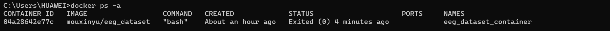

Next, use the following command to start a stopped container and enter its command line interface:

```
docker start eeg_dataset_container
docker exec -it eeg_dataset_container /bin/bash
```

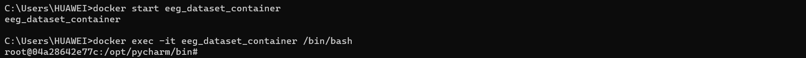

### Caveat

When using WSL and Docker, please ensure that your system has sufficient memory space. Additionally, in some cases, you may need to connect to a VPN to access external networks. If you don't have enough memory or are not connected to a VPN, you may experience issues such as lag or unresponsive commands.
